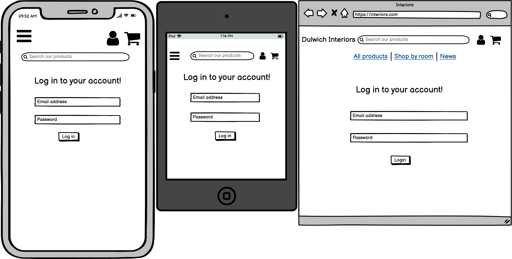
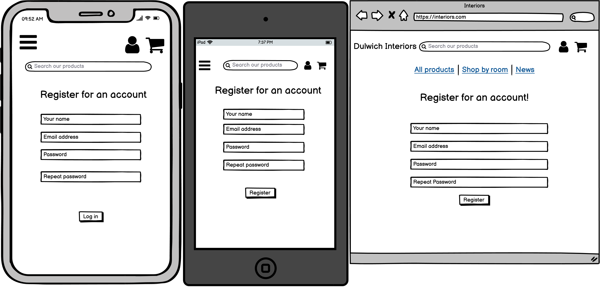
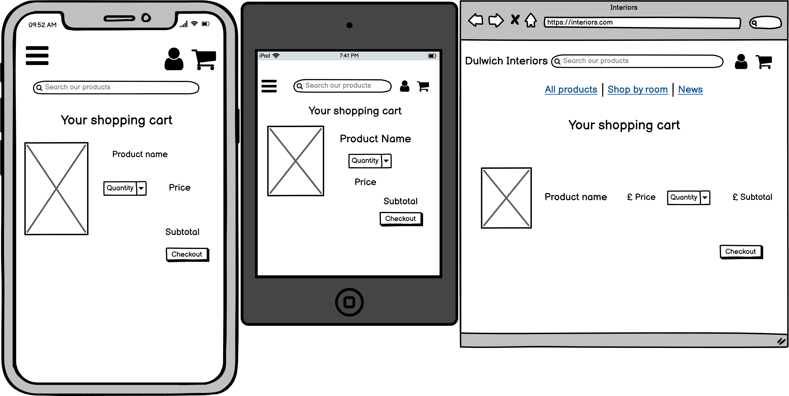
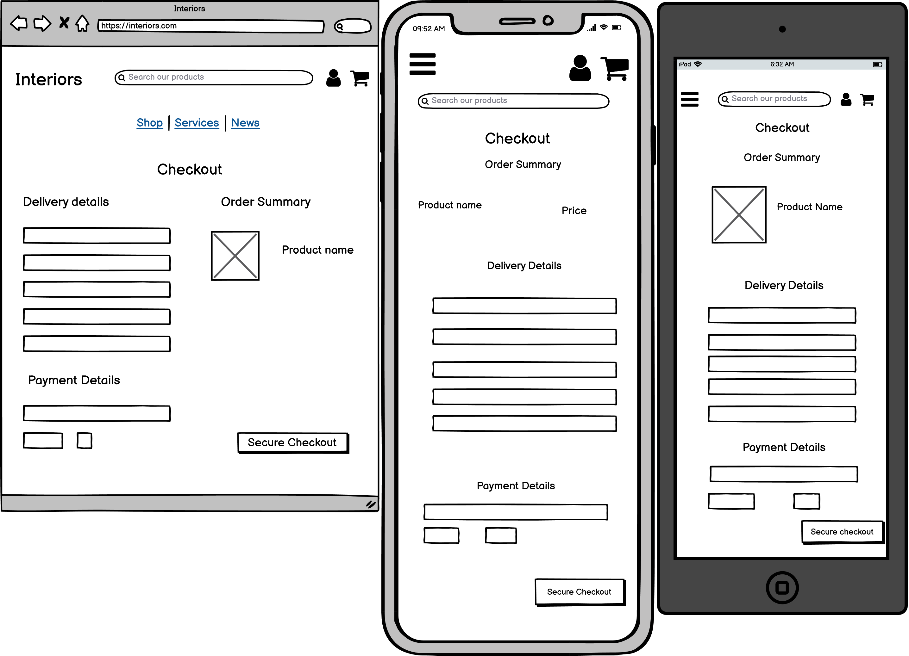
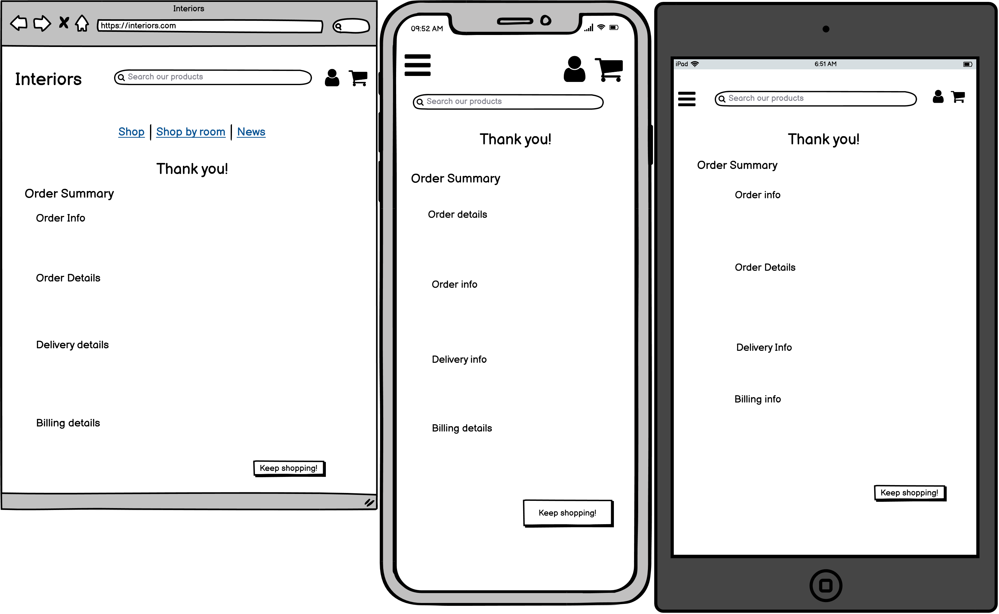
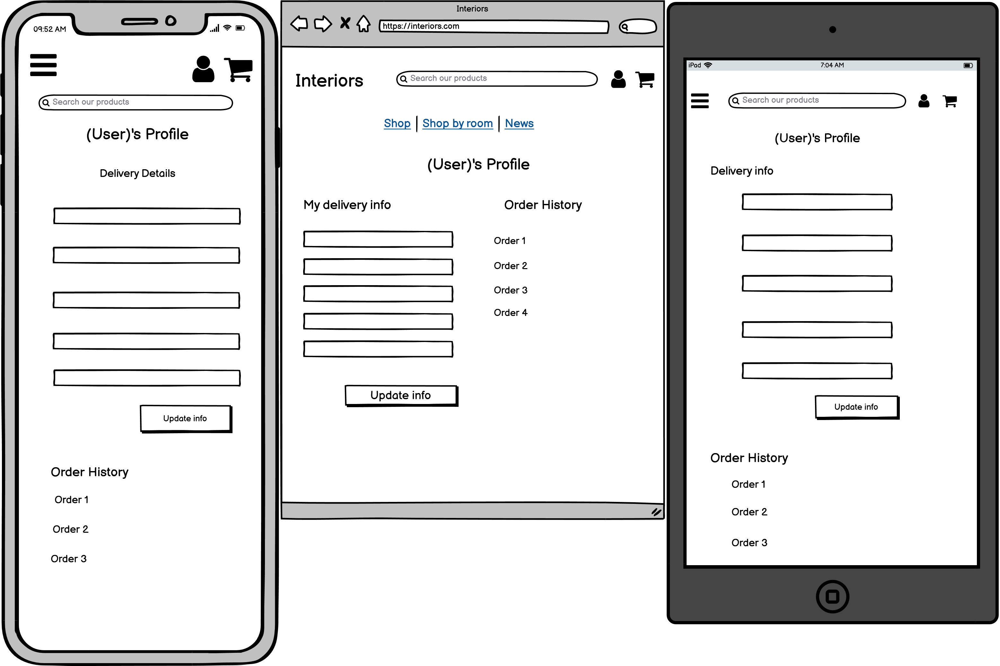

# Dulwich Interiors
## An online interior design store
A website for customers / potential customers to browse products and services and potentially make a purchase.

Live website: 

# UX
### Who this website is for:
This website is for customers interested in buying home interior products.

### What they want to achieve:
They want to be able to browse through products and potentially make a purchase. 

### This project is the best way to help them achieve these things because:
The simple, clear layout of the site allows users to easily add items to their cart and make a purchase.

## User Stories:
### Site user
1. As a user, I want to easily browse through all products for sale.
2. As a user, I want to view a specific category/room of products
3. As a user, I want to search for a product I need.
4. As a user, I want to view details of each product on the site.
5. As a user, I want to be able to add a product/products to my shopping bag.
6. As a user, I want to be able to purchase items that are in my shopping bag.
7. As a user, I want to create and sign in to my account.
8. As a signed in user, I want to be able to save my delivery details for my next purchase.
9. As a user, I want to read news/updates on the business.
10. As a user, I want to be able to comment on news/updates uploaded by the business - to show support / ask questions. 

### Site / business owner
1. As a site owner, I want to be able to add/edit and delete products and services on the site.
2. As a site owner, I want to be able to upload news/updates about the business. 

## Design 
### Color Scheme 
The following colors were selected for use across the site:
#AD974F HUSK - This is a golden shade of yellow which gives the site a high end classy feel.
#231F20 AUBERGINE - A slighter lighter than black shade which contrasts the other colors.
#EAEAEA WHISPER - An off white shade for backgrounds. 

### Typography 
'Dancing Script' family from Google Fonts was used throughout the site. I selected this font as I thought it complimented the clean, classy feel of the site.

## Wireframes:
<details>
<summary>Home (Click for images)</summary>
<p align="center">


</p>
</details>

<details>
<summary>Products (Click for images)</summary>
<p align="center">


</p>
</details>

<details>
<summary>Product details (Click for images)</summary>
<p align="center">


</p>
</details>

<details>
<summary>Login (Click for images)</summary>
<p align="center">


</p>
</details>

<details>
<summary>Register (Click for images)</summary>
<p align="center">


</p>
</details>

<details>
<summary>Cart (Click for images)</summary>
<p align="center">


</p>
</details>

<details>
<summary>Checkout (Click for images)</summary>
<p align="center">


</p>
</details>


<details>
<summary>Checkout Success (Click for images)</summary>
<p align="center">


</p>
</details>

<details>
<summary>Profile (Click for images)</summary>
<p align="center">


</p>
</details>


# Features

### Navbar
- Bootstrap navbar available across all pages
- First row contains shop logo that takes user back to home page as expected, a search bar to search products, and two logos - one for the user to login/register/visit their profile and one to take the user to their shopping cart.
- Second row contains links to the All Products page, a dropdown to filter products by room and a link to take the user to the companies 'News' page.

### Homepage
- Contains a carousel of images displaying home interiors 
- First image contains button that links to the All Products page to encourage users to shop the collection 

### Products page
- Easily accesible by selecting the 'Products' option from the navbar
- All Products page shows the user each item for sale at the moment
- Each product is displayed in a card showing an image of the product, the product name, and the price
- Each card also has a button to 'View product' which bring the user to the product detail page of that product

### Product details page
- Individual page for each product to show more details
- Includes the product name, product image, price of product and product description
- User has the option of selecting the quantity they would like to purchase (up to 6)
- User then has the option to add this quantity of the item to their cart, by selecting the 'Add to cart' button - On selecting this a toast message will appear advising the user that the item has been added to their cart
- User also has the option to 'Keep shopping' if they don't wish to purchase the item

### Cart
- Accessed by selecting the cart icon from the navbar
- Gives user the ability to view the product information of items in their cart including a small picture of the product, the product name, the price and the quantity
- User has the option of updating the quantity of the item, or removing the item from their cart completely
- Two buttons at the bottom of the page allow the user to either 'Keep shopping' or move forward to the 'Checkout' page 

### Checkout
- The checkout page consists of two columns - one with a form for the user to fill out and one with an order summary 
- The order summary includes a breakdown of the order including delivery prices (delivery is 20% of each order)
- The checkout form will pull through the users profile information if they are logged in (so that they don't need to fill it out each time)
- Form wil ask for the users name, email address, shippping details and payment details to complete the purchase
- The user will have two options at the bottom of the page - 'Adjust cart' if they need to make changes to their order before purchasing and 'Pay now' to complete the order
- The user will be warned that their card will be charged if they select the 'Pay now' button

### Checkout Success
- A page to let the user know that their purchase has been successful 
- Heading of page will thank the user 
- Page will contain the order information (including unique order number), delivery details and billing information 
- Button at the bottom of the page to allow user to 'Keep shopping' taking them back to the Products page to browse 

### Log in / register functionality 
- A user who is not logged in will have the option to 'Login' or 'Register' from the Profile icon in the navbar.
- Django allauth was used for account management
- If user selects to 'Register' they will be brought to a registration page which asks for their email address, and to create a username and password
- An email will then be sent to the user to verify their account
- If user selects to login they will be brought to the login page where they can enter their username and password 
- If a user logs in as a superuser/admin (store owner) they will have different functionality (explained below)

### Profile
-  A logged in user can access their Profile page from the Profile icon in the navbar
- Profile page will have two columns - one with the users default information and one with the users order history 
- The default information column is a form for the user to fill out and save so that they don't need to enter all of these details everytime they checkout 
- The order history column has an order number link which takes the user to the order confirmation for that individual order
- The order history column also tells the user the order date, details and price

### Toasts
- Bootstrap toasts act as alert messages for the user throughout their journey - Letting them know when an item was added to their cart/removed from their cart, if their order was succesfull, if they are logged in or logged out. 
- Admin also get alerts when they add/delete a product or blog post.

### News blog
- The company news page acts as a message board for the community
- Admin can add business updates in the form of blog posts to keep customers informed of any important business updates (such as COVID closures)
- This also acts as a discussion board, as logged in users can comment and show support on posts 
- Admin have the option of adding, editing and deleting blog posts
- Logged in users have the option to add comments to blog posts 

### Admin functionality 
- When a user is logged in as a superuser (store owner) they will have different functionality to a regular user
- When they select the Profile icon from the navbar they will have the options to Add a Blog Post, Add a Product as well as go to their Profile or logout
- If they select to add a product, they will be taken to a page to fill out a form and add a product
- If they select to add a blog post, they will be taken to a page to fill out a form and add a post


### Features Left to Implement

# Technologies Used
## Languages, frameworks and libraries used
* HTML5, CSS3, Javascript and Python were the programming languages used.
* Django framework used to build the application. 
* [Github](https://github.com/) - Used for hosting repository and version control
* [Bootstrap 5](https://getbootstrap.com/docs/5.0/getting-started/introduction/) - Bootstraps latest version 5 was used for layout and responsiveness. 
* [jQuery](https://jquery.com/)- jQuery was used throughout the site.
* [Heroku Postgres](https://www.heroku.com/postgres) - Used as database.
* django allauth

## Other technologies used
* [Heroku](http://heroku.com/) - Used to deploy project.
* [Stripe](https://stripe.com/gb) - System used for payments.
* [AWS](https://aws.amazon.com/) - Used to host static files.
* [Google Fonts](https://fonts.google.com/) - Used to import font for site.
* [Balsamiq](https://balsamiq.com/wireframes/) - Desktop app used to create wireframes.
* [Font Awesome](https://fontawesome.com/) - Used for all icons.
* [HTML CSS Color](https://www.htmlcsscolor.com/) - Used to select colors for site.
* [Pexels](https://www.pexels.com/) - Stock photos used for product images. 

# Testing


# Deployment

## Local deployment
## Local Deployment 

-	Log in to https://github.com/ and open https://github.com/EimearCunningham/dulwich-interiors
-	Select the ‘Code’ dropdown and copy the HTTPS link
-	Open your IDE environment and in the terminal type:
```
git clone (paste HTTPS link from above)
```

-	Install all requirements from the repository by going to the terminal and typing:
```
pip3 install -r requirements.txt
```
-	Set the following environment variables in gitpod settings:
	- DEVELOPMENT = True
	- SECRET_KEY = "type secret key here"
	- STRIPE_PUBLIC_KEY = "type stripe public key here"
	- STRIPE_SECRET_KEY = "type stripe secret key here"
	- STRIPE_WH_SECRET = "type stripe webhook secret key here"

-	Make migrations and migrate to the database by typing the following commands in the terminal:
```
 python3 manage.py makemigrations
	python3 manage.py migrate
```
-	Create a superuser by typing in the terminal: 
```
python3 manage.py createsuperuser
```


## Deploying to Heroku 

- Create a Heroku account and app:
    - Go to https://signup.heroku.com/login and create an account.
    - From your dashboard click 'Create app'.
    - Create a name for the app and select the region closest to you.
    - Click 'Create app'.

- Set up Postgres database on app:
    - Go to 'Resources' tab of Heroku app.
    - Search for 'Postgres'.
    - Add Postgres to the app, selecting to use the free development plan.

- Install requirements in workspace:
    - Install dj_database_url and psycopg2-binary 
    ```
        pip3 install dj_database_url
            
        pip3 install psycopg2_binary
    ```       

- Freeze new requirements to requirements.txt
    ```
        pip3 freeze > requirements.txt
    ```

- Go to settings.py file and import dj_database_url
    ```python
        import dj_database_url
    ```
    
- Add Postgres database settings to settings.py
    ``` python
        DATABASES = {
            'default': dj_database_url.parse('ENTER DATABASE URL FROM APP CONFIG SETTINGS HERE')
        }
    ```

- Comment out settings for sqlite database
- Migrate to new Postgres database
    ``` 
        python3 manage.py migrate
    ```

- Create a superuser:
    ```
        python3 manage.py createsuperuser
    ```
    
    **Here I made the error of pushing to github without removing my Postgres Database URL. I fixed this by creating a completely new app and DB URL so that it wasn't pushed to Github at any stage**

- Add the following statement to settings.py to use Postgres DB if available and sqlite DB if not:
    ``` python
        if "DATABASE_URL" in os.environ:
            DATABASES = {
                "default": dj_database_url.parse(os.environ.get('DATABASE_URL'))
                }
        else:
            DATABASES = {
                'default': {
                    'ENGINE': 'django.db.backends.sqlite3',
                    'NAME': BASE_DIR / 'db.sqlite3',
                }
            }
    ```
- Postgres database has now been set up.

- To complete the Heroku set up we need to install gunicorn and add it to a Procfile as shown:
    ```
        pip3 install Gunicorn
    ```
- In Procfile:
    ```
        web: gunicorn dulwich_interiors.wsgi:application
    ```

- Log into Heroku through your workspace termnial:
    ```
        heroku login -i
    ```

- Disable static file collection for now
    ```
        heroku config:set DISABLE_COLLECTSTATIC=1 --app <insert Heroku app name here>
    ```
        
- In settings.py add:
    ``` python
        ALLOWED_HOSTS = ['dulwich-interiors-ms4.herokuapp.com', 'localhost']
    ```
- Add and commit changes to github
- Push to Heroku
    ```
        heroku git:remote -a <dulwich-interiors-ms4>
        git push heroku master
    ```

- Enable automatic deploys to heroku
        - Go to setting tab of Heroku app
        - Click 'Connect to Github' and search for respository
        - Select repository
        - Click 'Enable automatic deploys'

## Setting up AWS to host static files & images:
- Go to https://aws.amazon.com/ and create an account
- Go to the AWS Management Console from within your account, and search for 'S3'
- Access S3 and create a new bucket by selecting 'Create bucket'
- Name bucket 'dulwich-interiors-ms4' and select nearest region
- Uncheck box that says 'Block all public access' and tick box to acknowledge that the bucket will be public.
- When bucket is created, go to 'Properties' tab and turn on static website hosting, selecting the option to 'Use this bucket to host a website'
- Go to 'Permissions' tab and then 'CORS' configuration tab and add the following code:
``` [
  {
      "AllowedHeaders": [
          "Authorization"
      ],
      "AllowedMethods": [
          "GET"
      ],
      "AllowedOrigins": [
          "*"
      ],
      "ExposeHeaders": []
  }
]
```
- Go to 'Bucket Policy' tab and select 'Policy Generator' - This will lead to a AWS Policy Generator page. On this page select 'S3' Bucket as the Policy Type, set the 'Principal' input to '*' and the Action dropdown to 'GetObject'
- Go back to 'Bucket Policy' tab and copy the ARN. Paste into ARN box on AWS Policy Generator page
- Select to 'Generate Policy' and then copy the policy into the 'Bucket Policy' editor. Add a '/*' onto the end of the 'Resource' key before saving
- Go to 'Access Control' tab and select 'Everyone' under the Public Acces heading - Then set the 'List actions' box and save. Bucket is now set up.
- Go back to AWS Services menu and search for IAM
- Select 'Groups' and then 'Create a new group' called 'manage-dulwich-interiors'
- Create a policy by selecting 'Policies' from the navbar and then 'Create policy'. Go to JSON tab and select 'Import managed policy'. Import the policy named 'S3 full access policy'
- Go back to bucket and copy the ARN, paste into 'Resource' key of JSON code
- Click 'Review policy', give the policy a name and a description and 'Create policy'
- Attach the policy to the group we created: Go to 'Groups' and select the group just created. Click 'Attach policy' and search for the policy just created 
- Create a user for the group: Go to 'Users' page and 'Add user'. Create user called 'manage-dulwich-interiors' and give them Programatic Access
- Add the user to the group just created
- Click 'Create User' and download the excel file that is created 
- Connect Django to s3 by installing two new packages:
```
pip3 install boto3
pip3 install django-storages
```
- Freeze these requirements:
``` 
pip3 freeze > requirements.txt
```
- Go to installed apps in 'settings.py' file and add 'storages',
- Also in settings.py add:
```
if 'USE_AWS' in os.environ:
    AWS_STORAGE_BUCKET_NAME = 'dulwich-interiors-ms4'
    AWS_S3_REGION_NAME = 'eu-west-2'
    AWS_ACCESS_KEY_ID = os.environ.get('AWS_ACCESS_KEY_ID')
    AWS_SECRET_ACCESS_KEY = os.environ.get('AWS_SECRET_ACCESS_KEY')
```
- Go to the settings tab of Heroku app and select 'Reveal config variables'. Add the following config variables:
    - AWS_ACCESS_KEY_ID: (Get value from excel file)
    - AWS_SECRET_ACCESS_KEY: (Get value from excel file)
    - USE_AWS: True
- Delete the 'DISABLE_COLLECTSTATIC' variable
- Go to settings.py file, add:
```
AWS_S3_CUSTOM_DOMAIN = f'{AWS_STORAGE_BUCKET_NAME}.s3.amazonaws.com'
```
- Create a project level file named 'custom_storages.py' and add:
```
from django.conf import settings
from storages.backends.s3boto3 import S3Boto3Storage


class StaticStorage(S3Boto3Storage):
    location = settings.STATICFILES_LOCATION


class MediaStorage(S3Boto3Storage):
    location = settings.MEDIAFILES_LOCATION
```
- Go back to settings.py and add:
```
STATICFILES_STORAGE = 'custom_storages.StaticStorage'
STATICFILES_LOCATION = 'static'
DEFAULT_FILE_STORAGE = 'custom_storages.MediaStorage'
MEDIAFILES_LOCATION = 'media'

STATIC_URL = f'https://{AWS_S3_CUSTOM_DOMAIN}/{STATICFILES_LOCATION}/'
MEDIA_URL = f'https://{AWS_S3_CUSTOM_DOMAIN}/{MEDIAFILES_LOCATION}/'
```
- Add, commit and push these changes
- To settings.py add:
```
AWS_S3_OBJECT_PARAMETERS = {
        'Expires': 'Thu, 31 Dec 2099 20:00:00 GMT',
        'CacheControl': 'max-age=94608000',
    }
```
- Go to s3 and create a folder called 'Media'. Upload product images to this file. Make sure to select to 'Grant public read access to these objects' before selecting to upload


# Credits

## Code


**This site is for educational purposes only** 