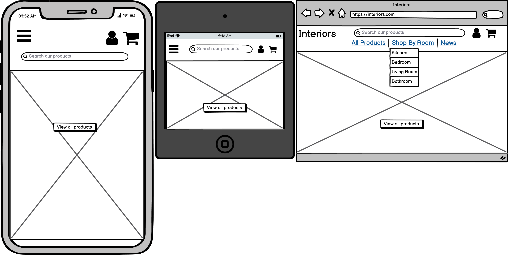
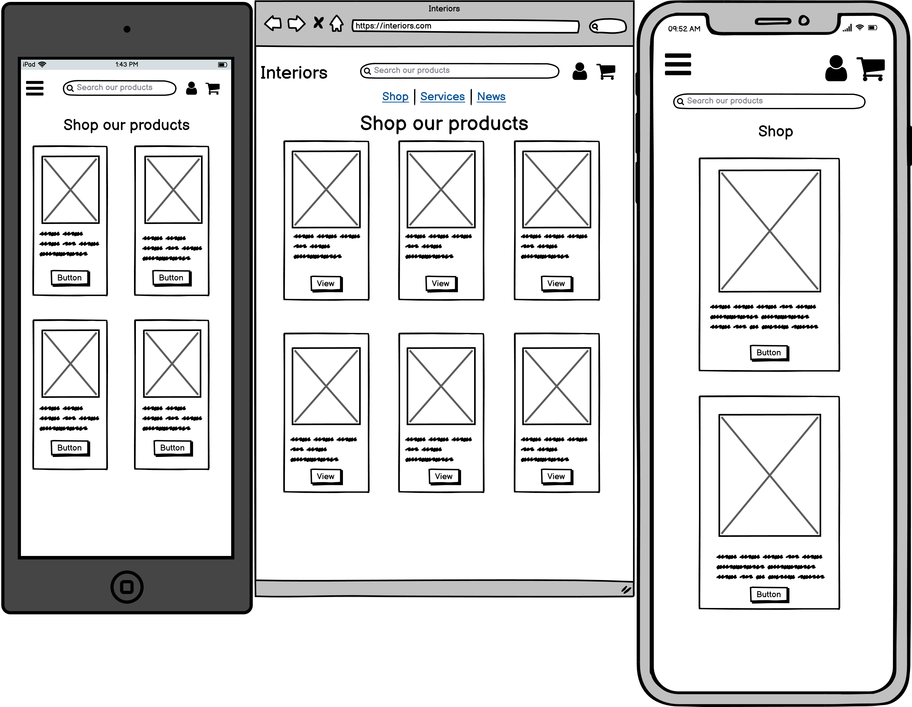
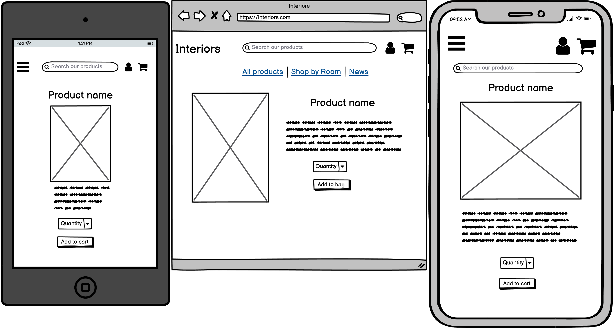

# Dulwich Interiors
## An online interior design store
A website for customers / potential customers to browse products and services and potentially make a purchase.

Live website: 

# UX
### Who this website is for:
This website is for customers interested in buying home interior products.

### What they want to achieve:
They want to be able to browse through products and potentially make a purchase. 

### This project is the best way to help them achieve these things because:
The simple, clear layout of the site allows users to easily add items to their cart and make a purchase.

## User Stories:
### Site user
1. As a user, I want to easily browse through all products for sale.
2. As a user, I want to view a specific category/room of products
3. As a user, I want to search for a product I need.
4. As a user, I want to view details of each product on the site.
5. As a user, I want to be able to add a product/products to my shopping bag.
6. As a user, I want to be able to purchase items that are in my shopping bag.
7. As a user, I want to create and sign in to my account.
8. As a signed in user, I want to be able to save my delivery details for my next purchase.
9. As a user, I want to read news/updates on the business.

### Site / business owner
1. As a site owner, I want to be able to add/edit and delete products and services on the site.
2. As a site owner, I want to be able to upload news/updates about the business. 

## Design 
### Color Scheme 

### Typography 
'Montserrat' family from Google Fonts was used throughout the site. I selected this font as I thought it complimented the clean, simple feel of the site. 

## Wireframes:

Home (Click for images)

Products (Click for images)

Product details (Click for images)

# Features

## Features Left to Implement

# Technologies Used
## Languages, frameworks and libraries used

## Other technologies used

# Testing

# Deployment

# Credits

## Code

**This site is for educational purposes only** 